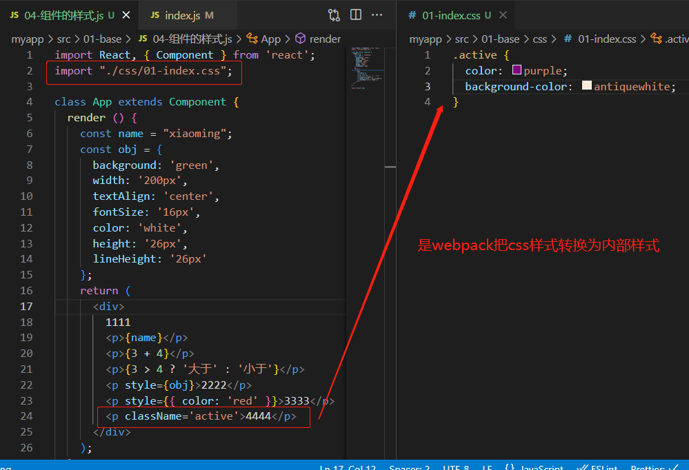
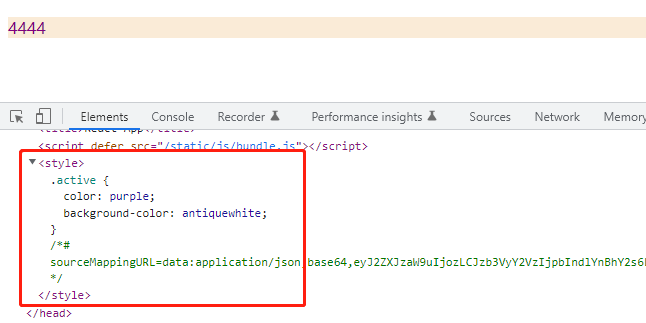

# React

### 1. React 的原始写法，通过 babel 把 jsx 转为 js 对象的形式

```js
ReactDOM.render(
  <div id="aaa" style={{ color: 'red' }}>
    <p id="bbb">111</p>
    <p id="ccc">222</p>
  </div>,
  document.getElementById('root')
);
```

```js
ReactDOM.render(
  React.createElement(
    'div',
    {
      id: 'aaa',
      style: {
        color: 'red',
      },
    },
    [
      React.createElement('p', { id: 'bbb' }, 111),
      React.createElement('p', { id: 'ccc' }, 222),
    ]
  ),
  document.getElementById('root')
);
```

### 2. 组件

#### 2-1. 类组件

#### 2-2. 函数组件：在 16.8 之前是无状态组件，在 16.8 之后有了 react hooks，也可以使函数组件变成有状态组件

### 3. JSX 内使用一个{}表示变量或表达式的执行，import 引入 style 样式的方式，是 webpack 配置好的，webpack 会把 import 进来的 style 样式当成内部样式





<font color="red" size="4">\* 1、面试题：react 的绑定事件机制跟普通事件是一样的吗？</font>

### 不一样，普通事件是直接绑定在当前元素身上，react 的事件是全部绑定在根节点身上，采取事件代理的方式冒泡到当前元素。但是 react 的事件跟普通事件一样都有 event 对象，用法一致。

### 4.ref 的应用：可以获取 dom 节点或者组件实例

#### 1.旧写法：给标签设置 ref="myinput",通过这个获取 this.refs.myinput 获取 dom 节点

```js
<input ref="myinput" />;
访问this.refs.myinput;
```

### 2.新写法：

```js
myref = React.createRef();
<input ref={this.myref} />;
访问this.myref.current;
```
