# React 全家桶

## 一、React 介绍

### 1. React 起源与发展

### 2013 年 5 月起源于 Facebook 的内部项目

### 2. React 的特性

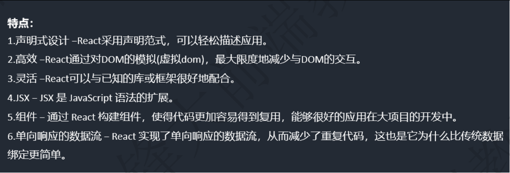

### 3. 虚拟 DOM

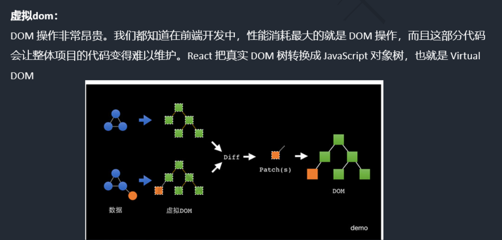

## 二、[create-react-app](https://create-react-app.dev/docs/proxying-api-requests-in-development)

### 1.方式一：需全局安装 create-react-app

```bash
npm i -g create-react-app
create-react-app myapp
```

### 2.方式二：临时安装

```bash
npx create-react-app myapp
```

## 三、react 基础

### 1. React.createElement

### React 的原始写法，使用 通过 babel 把 jsx 转为 js 对象的形式

```js
ReactDOM.render(
  <div id="aaa" style={{ color: 'red' }}>
    <p id="bbb">111</p>
    <p id="ccc">222</p>
  </div>,
  document.getElementById('root')
);
```

```js
ReactDOM.render(
  React.createElement(
    'div',
    {
      id: 'aaa',
      style: {
        color: 'red',
      },
    },
    [
      React.createElement('p', { id: 'bbb' }, 111),
      React.createElement('p', { id: 'ccc' }, 222),
    ]
  ),
  document.getElementById('root')
);
```

### 2. class 组件 rcc

```js
import React from 'react';
class MyApp extends React.Component {
  render() {
    return <div>111</div>;
  }
}
export default MyApp;
```

### 3. 函数组件

### 在 16.8 之前是无状态组件，在 16.8 之后有了 react hooks，也可以使函数组件变成有状态组件

```js
function MyApp() {
  return <div>11---1</div>;
}

const MyApp2 = () => <div>MyApp</div>;

export default MyApp2;
```

### 4. 组件样式

### JSX 内使用一个{ }表示变量或表达式的执行

```js
import React, { Component } from 'react';
import './css/01-index.css';

class MyApp extends Component {
  render() {
    const style = {
      background: 'red',
      width: 200,
      textAlign: 'center',
      color: '#fff',
    };

    return (
      <div>
        <p
          style={{
            background: 'green',
            width: 200,
            textAlign: 'center',
            color: 'white',
          }}
        >
          第一种展示样式方法
        </p>
        <p style={style}>第二种展示样式方法</p>
        <p className="highlight">
          第三种展示样式方法，通过引入外部样式，webpack把样式当做head标签内的内部样式执行了
        </p>
      </div>
    );
  }
}

export default MyApp;
```

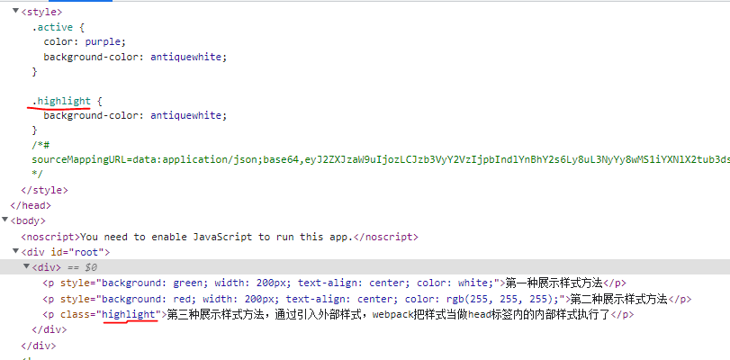

### 5. ref

### ref 可以获取 dom 节点或者整个组件的实例

```js
myref = React.createRef();
<input ref={this.myref} id="input2" />;
// 访问 this.myref.current.value
console.log(this.myref.current.value);
```

### 6. 事件绑定

### react 的绑定事件机制跟普通事件是一样的吗？

### 不一样，普通事件是直接绑定在当前元素身上，react 的事件是全部绑定在根节点身上，采取事件代理的方式冒泡到当前元素。但是 react 的事件跟普通事件一样都有 event 对象，用法一致。

```js
import React, { Component } from 'react';

class MyApp extends Component {
  state = {
    text: '文本',
  };

  handleClick1 = () => {
    console.log(this.state.text + '1');
  };

  handleClick3() {
    console.log(this.state.text + '3');
  }

  handleClick4() {
    console.log(this.state.text + '4');
  }

  render() {
    return (
      <div>
        <button onClick={this.handleClick1}>点击1</button>
        <button
          onClick={() => {
            console.log(this.state.text + '2');
          }}
        >
          点击2
        </button>
        <button onClick={this.handleClick3.bind(this)}>点击3</button>
        <button onClick={() => this.handleClick4()}>点击4</button>
      </div>
    );
  }
}

export default MyApp;
```

### 7. state 状态

```js
import React, { Component } from 'react';

class MyApp extends Component {
  state = {
    isShow: true,
  };

  render() {
    const { isShow } = this.state;
    return (
      <div>
        <h1>欢迎来到react的世界</h1>
        <button
          onClick={() => {
            this.setState({
              isShow: !isShow,
            });
          }}
        >
          {isShow ? '收藏' : '取消收藏'}
        </button>
      </div>
    );
  }
}

export default MyApp;
```

### 8. 列表渲染

### 为了列表的复用和重排，设置 key 值，提高性能；理想的 key 是 item.id，如果不涉及列表的增加删除重排，可以设置成索引

```js
import React, { Component } from 'react';

class MyApp extends Component {
  constructor() {
    super();
    this.state = {
      arr: [
        {
          id: 1,
          text: '111',
        },
        {
          id: 2,
          text: '222',
        },
        {
          id: 3,
          text: '333',
        },
      ],
    };
  }

  render() {
    const { arr } = this.state;
    return (
      <div>
        <ul>
          {arr.map((item) => {
            return <li key={item.id}>{item.text}</li>;
          })}
        </ul>
      </div>
    );
  }
}

export default MyApp;
```

### 9. dangerouslySetInnerHTML

### dangerouslySetInnerHTML 可以把一段代码片段变成 html，然后插入到某个地方，可能会造成 xss 攻击

```js
import React, { Component } from 'react';

class MyApp extends Component {
  constructor() {
    super();
    this.state = {
      myHtml: `<b style="color: red;">111</b>`,
      inputHtml: '',
    };
  }

  myRef = React.createRef();

  handleOk = () => {
    const inputValue = this.myRef.current.value;
    this.setState({
      inputHtml: inputValue,
    });
  };

  render() {
    const { myHtml, inputHtml } = this.state;
    return (
      <div>
        <div
          dangerouslySetInnerHTML={{
            __html: myHtml,
          }}
        ></div>

        <div>
          <input ref={this.myRef} />
          <button onClick={this.handleOk}>确定</button>
        </div>

        <div
          dangerouslySetInnerHTML={{
            __html: inputHtml,
          }}
        ></div>
      </div>
    );
  }
}

export default MyApp;
```

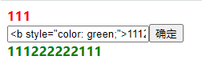

### 10. setState 同步异步

### <1> 每次调用 setState 都会引发虚拟 dom 的对比，每次 setState 都会引起 render 重新渲染

### <2> setState 处在同步的逻辑中，是异步更新状态，异步更新真实 dom

#### setState 会合并更新[batch update]状态，把几次的 setState 合并成一次以最后一次为主，访问到的状态是老状态

#### setState 接受第二个参数，第二个参数是回调函数，状态和 dom 更新完后就会被触发

#### 等同步的执行完，再执行异步的

### <3> setState 处在异步的逻辑中，是同步更新状态，同步更新真实 dom，访问到的状态是更新后的状态

```js
import React, { Component } from 'react';

class MyApp extends Component {
  state = {
    count: 0,
  };

  handleClick1 = () => {
    this.setState(
      {
        count: this.state.count + 1,
      },
      () => {
        console.log(this.state.count, '1()'); // 4
      }
    );
    console.log(this.state.count, '1'); // 1-先执行，后面的按序号

    this.setState(
      {
        count: this.state.count + 1,
      },
      () => {
        console.log(this.state.count, '2()'); // 5
      }
    );
    console.log(this.state.count, '2'); // 2

    this.setState(
      {
        count: this.state.count + 1,
      },
      () => {
        console.log(this.state.count, '3()'); // 6
      }
    );
    console.log(this.state.count, '3'); // 3
  };

  handleClick2 = () => {
    // setTimeout是异步的
    setTimeout(() => {
      this.setState({
        count: this.state.count + 1,
      });
      console.log(this.state.count, '1'); // 1-先执行，后面的按序号

      this.setState({
        count: this.state.count + 1,
      });
      console.log(this.state.count, '2'); // 2

      this.setState({
        count: this.state.count + 1,
      });
      console.log(this.state.count, '3'); // 3
    }, 0);
  };

  render() {
    return (
      <div>
        {this.state.count}
        <button onClick={this.handleClick1}>点击1</button>
        <button onClick={this.handleClick2}>点击2</button>
      </div>
    );
  }
}

export default MyApp;
```

### 11. props 属性

### <1> 在引用组件上使用 key="value"的形式传递 props，在类组件内部通过 this.props 访问 props 属性，在函数组件通过 props 形参访问

### <2> 属性的验证：通过 prop-types，类组件写成对象属性的形式，函数组件写成类属性的形式

### <3> 属性的默认值：defaultProps，传进来的参数会覆盖默认值

```js
import React, { Component } from 'react';
import PropTypes from 'prop-types';

class Navbar extends Component {
  a = 1; // 对象属性，需要实例化对象，访问的时候需要new一个对象 let obj = new Navbar(); obj.a

  // 把类属性挪到里面，要加static表示它是类属性，不需要实例化，访问的时候Navbar.propTypes
  static propTypes = {
    title: PropTypes.string,
    leftBtn: PropTypes.bool,
    rightBtn: PropTypes.bool,
  };

  static defaultProps = {
    leftBtn: true,
    rightBtn: true,
  };

  render() {
    const { title, leftBtn, rightBtn } = this.props;
    return (
      <div>
        {leftBtn && <button>返回</button>}
        <span>{title}</span>
        {rightBtn && <button>搜索</button>}
      </div>
    );
  }
}

export default Navbar;

// 类属性
// Navbar.propTypes = {
//   title: PropTypes.string,
//   leftBtn: PropTypes.bool,
//   rightBtn: PropTypes.bool
// };
// 默认属性
// Navbar.defaultProps = {
//   leftBtn: true,
//   rightBtn: true
// };
```

```js
import React from 'react';
import PropTypes from 'prop-types';

export default function SiderBar(props) {
  const { background, position } = props;
  const obj = {
    background,
    width: 200,
    height: 200,
    position: 'fixed',
    top: 30,
  };
  const obj1 = { left: 0 };
  const obj2 = { right: 0 };
  const styleObj =
    position === 'left' ? { ...obj, ...obj1 } : { ...obj, ...obj2 };
  return (
    <div>
      <ul style={styleObj}>
        <li>111</li>
        <li>222</li>
        <li>333</li>
        <li>444</li>
        <li>555</li>
        <li>666</li>
      </ul>
    </div>
  );
}

// 函数组件只能通过类属性来定义类型
SiderBar.propTypes = {
  background: PropTypes.string,
  position: PropTypes.string,
};

SiderBar.defaultProps = {
  background: '',
  position: '',
};
```

### <4> 特殊属性：children-插槽，在父组件文件中引入子组件标签的内部再插入 jsx，此时需要在子组件预留一个位置显示 children，children 是个数组。插槽一是为了复用，二是一定程度的减少父子通信

```js
import React, { Component } from 'react';

// 点击展开收起让SiderBar显示隐藏，把button当成插槽放到父组件中去

class Navbar extends Component {
  render() {
    return (
      <div style={{ background: 'yellow' }}>
        {this.props.children}
        Navbar
      </div>
    );
  }
}

class SiderBar extends Component {
  render() {
    return (
      <div
        style={{
          background: '#fcc',
          width: 300,
          height: 300,
          display: this.props.isShow ? 'block' : 'none',
        }}
      >
        SiderBar
      </div>
    );
  }
}

class MyApp extends Component {
  state = {
    isShow: false,
  };

  toggleShow = () => {
    this.setState({
      isShow: !this.state.isShow,
    });
  };

  render() {
    const { isShow } = this.state;
    return (
      <div>
        <Navbar>
          <button
            onClick={() => {
              this.toggleShow();
            }}
          >
            展开收起
          </button>
        </Navbar>
        <SiderBar isShow={isShow} />
      </div>
    );
  }
}

export default MyApp;
```

### 12. 受控与非受控

### <1> 表单的受控：1.靠修改 state 的值引起 render 重新渲染实现。通过表单组件的 value 属性以及 onChange 事件，value 的值由 state 控制，调用 onChange 去修改 state 的值，setState 每次改变都会触发 render 重新渲染，所以表单组件的 value 值能确保是最新的。2.也可以靠 ref 获取子组件的实例，获取子组件 state 的值以及修改值

### 原生的 input 标签跟 React 中的 input 标签有什么区别？1.原生 input 标签上的监听输入框实时改变的事件是 oninput，React 中监听输入框实时改变的事件是 onChange

### <2> 表单的非受控：是用 ref 取原生 dom 节点的方式，设置默认值用 defaultValue，但是无法实现与其他组件通信。

### <3> 组件的受控：组件的数据渲染应该由被调用者传递的 props 完全控制，控制则为受控组件，否则是非受控组件。多写无状态组件，少写有状态组件。组件尽量不要有自己的状态，状态应该由传过来的 props 完全控制。

```js
import React, { Component } from 'react';

class MyApp extends Component {
  state = {
    username: 'xiaoming',
  };

  render() {
    const { username } = this.state;
    return (
      <div>
        <input
          value={username}
          type="text"
          onChange={(evt) => {
            this.setState({
              username: evt.target.value,
            });
          }}
        />
        <button
          onClick={() => {
            console.log(username);
          }}
        >
          登录
        </button>
        <button
          onClick={() => {
            this.setState({
              username: '',
            });
          }}
        >
          重置
        </button>
      </div>
    );
  }
}

export default MyApp;
```

## 四、组件通信

### <1> 父子通信

### 在父组件上通过 key="value" 的形式传参给子组件；在父组件上定义一个回调函数，子组件调用回调函数与父组件通信。父组件引用 ref 获取子组件的实例，获得子组件上所有的属性。

```js
import React, { Component } from 'react';

// 点击按钮让SiderBar显示隐藏
class NavBar extends Component {
  render() {
    const { event } = this.props;
    return (
      <div style={{ background: 'green' }}>
        <button
          onClick={() => {
            event();
          }}
        >
          按钮
        </button>
        <span>NavBar</span>
      </div>
    );
  }
}

class SiderBar extends Component {
  render() {
    return (
      <ul style={{ background: 'yellow', width: 200 }}>
        <li>1</li>
        <li>2</li>
        <li>3</li>
        <li>4</li>
      </ul>
    );
  }
}

class MyApp extends Component {
  state = {
    isShow: true,
  };

  handleEvent = () => {
    this.setState({
      isShow: !this.state.isShow,
    });
  };

  render() {
    const { isShow } = this.state;
    return (
      <div>
        <NavBar event={this.handleEvent} />
        {isShow && <SiderBar />}
      </div>
    );
  }
}

export default MyApp;
```

### <2> 兄弟组件通信：

### 通过父组件中间人模式通信，兄弟 A 组件回调给父组件，父组件存到 state，再传递给兄弟 B 组件，由此实现兄弟组件通信。兄弟组件通信不适用于叔侄通信，会显得代码很累赘。

```js
import React, { Component } from 'react';
import axios from 'axios';
import './css/兄弟组件通信.css';

// FilmItem 与 FilmDetail通信
class MyApp extends Component {
  state = {
    filmList: [],
    info: '',
  };

  componentDidMount() {
    axios({
      method: 'get',
      url:
        'https://m.maizuo.com/gateway?cityId=110100&pageNum=1&pageSize=10&type=2&k=764626',
      headers: {
        'X-Client-Info':
          '{"a":"3000","ch":"1002","v":"5.2.1","e":"16789325361560653676412929"}',
        'X-Host': 'mall.film-ticket.film.list',
      },
    }).then((res) => {
      this.setState({
        filmList: res.data.data.films,
      });
    });
  }

  render() {
    return (
      <div className="app">
        <div>
          {this.state.filmList.map((item) => (
            <FilmItem
              key={item.filmId}
              {...item}
              onEventChange={(value) => {
                this.setState({
                  info: value,
                });
              }}
            />
          ))}
        </div>

        <FilmDetail info={this.state.info} />
      </div>
    );
  }
}

export default MyApp;

const FilmItem = (props) => {
  const { name, poster, actors, synopsis, onEventChange = () => {} } = props;
  return (
    <div
      className="filmItem"
      onClick={() => {
        onEventChange(synopsis);
      }}
    >
      
      <div>
        <p>{name}</p>
        <p>主演：{actors.map((item) => item.name).join(' ')}</p>
      </div>
    </div>
  );
};

function FilmDetail(props) {
  return <div className="filmDetail">{props.info || '--'}</div>;
}
```

### <3> 跨组件通信

### 通过发布订阅模式，定义一个共用的调度中心，内有发布订阅的方法，B 组件初始化就要订阅，在 A 组件一发布的时候就可以立马收到信息。

```js
import React, { Component } from 'react';
import axios from 'axios';
import './css/兄弟组件通信.css';

const bus = {
  list: [],

  // 订阅
  subscribe(callback) {
    // console.log(callback);
    this.list.push(callback);
  },

  // 发布
  publish(text) {
    // 遍历所有的list，将回调函数执行
    this.list.forEach((callback) => {
      callback && callback(text);
    });
  },
};

// FilmItem 与 FilmDetail通信
class MyApp extends Component {
  state = {
    filmList: [],
  };

  componentDidMount() {
    axios({
      method: 'get',
      url:
        'https://m.maizuo.com/gateway?cityId=110100&pageNum=1&pageSize=10&type=2&k=764626',
      headers: {
        'X-Client-Info':
          '{"a":"3000","ch":"1002","v":"5.2.1","e":"16789325361560653676412929"}',
        'X-Host': 'mall.film-ticket.film.list',
      },
    }).then((res) => {
      this.setState({
        filmList: res.data.data.films,
      });
    });
  }

  render() {
    return (
      <div className="app">
        <div>
          {this.state.filmList.map((item) => (
            <FilmItem key={item.filmId} {...item} />
          ))}
        </div>

        <FilmDetail />
      </div>
    );
  }
}

export default MyApp;

const FilmItem = (props) => {
  const { name, poster, actors, synopsis } = props;
  return (
    <div
      className="filmItem"
      onClick={() => {
        bus.publish(synopsis);
      }}
    >
      
      <div>
        <p>{name}</p>
        <p>主演：{actors.map((item) => item.name).join(' ')}</p>
      </div>
    </div>
  );
};

class FilmDetail extends Component {
  state = {
    info: '',
  };

  // 组件一上来就要订阅
  componentDidMount() {
    bus.subscribe((value) => {
      this.setState({
        info: value,
      });
    });
  }

  render() {
    return <div className="filmDetail">{this.state.info || '--'}</div>;
  }
}
```

### <4> 跨组件通信

### 所有想要通信的子组件必须包裹在 GlobalContext 定义的父组件内

```md
#### context 通信模式：生产者消费者模式

#### 1.把父组件当成生产者，使用 GlobalContext.Provider 包裹起来，传递 value 属性

#### 2.想要通信的子组件当成消费者，使用 GlobalContext.Consumer 包裹起来，里面使用回调函数取的共享状态的 value 属性，共享父组件的 value 属性
```

```js
import React, { Component } from 'react';
import axios from 'axios';
import './css/兄弟组件通信.css';

const GlobalContext = React.createContext(); // 创建一个生产者-供应商

// FilmItem 与 FilmDetail通信
class MyApp extends Component {
  state = {
    filmList: [],
    info: '',
  };

  componentDidMount() {
    axios({
      method: 'get',
      url:
        'https://m.maizuo.com/gateway?cityId=110100&pageNum=1&pageSize=10&type=2&k=764626',
      headers: {
        'X-Client-Info':
          '{"a":"3000","ch":"1002","v":"5.2.1","e":"16789325361560653676412929"}',
        'X-Host': 'mall.film-ticket.film.list',
      },
    }).then((res) => {
      this.setState({
        filmList: res.data.data.films,
      });
    });
  }

  render() {
    return (
      <div className="app">
        <GlobalContext.Provider
          value={{
            info: this.state.info,
            changeInfo: (value) => {
              this.setState({
                info: value,
              });
            },
          }}
        >
          <div>
            {this.state.filmList.map((item) => (
              <FilmItem key={item.filmId} {...item} />
            ))}
          </div>

          <FilmDetail />
        </GlobalContext.Provider>
      </div>
    );
  }
}

export default MyApp;

const FilmItem = (props) => {
  const { name, poster, actors, synopsis } = props;
  return (
    <GlobalContext.Consumer>
      {(value) => {
        return (
          <div
            className="filmItem"
            onClick={() => {
              value.changeInfo(synopsis);
            }}
          >
            
            <div>
              <p>{name}</p>
              <p>主演：{actors.map((item) => item.name).join(' ')}</p>
            </div>
          </div>
        );
      }}
    </GlobalContext.Consumer>
  );
};

function FilmDetail() {
  return (
    <GlobalContext.Consumer>
      {(value) => {
        // console.log(value);
        return <div className="filmDetail">{value.info ?? '--'}</div>;
      }}
    </GlobalContext.Consumer>
  );
}
```

### <5> 跨组件通信

### redux 状态管理

## 五、生命周期

### <1> 初始化：componentWillMount -> render -> componentDidMount

### a. UNSAFE_componentWillMount：16.2 版本后废弃，该状态是第一次上树前最后一次修改 state 的状态，dom 树还没渲染，只会执行一次。

### b.render

### c.componentDidMount：dom 树渲染完毕，只会执行一次。

### 数据请求 axios、订阅函数调用、setInterval、基于创建完的 dom 进行初始化(BetterScroll)

### <2> 更新阶段：render -> componentWillUpdate -> render -> componentDidUpdate

### a.render

### b.UNSAFE_componentWillUpdate：16.2 版本后废弃，更新之前的状态值。

### c.render

### d.componentDidUpdate：获取更新后的 dom 节点。缺点是：会执行多次，添加标志位进行判断。componentWillUpdate 有 2 个参数，prevProps 和 prevState，老的属性和老的状态

### 老的状态：prevState

### 老的属性：prevProps

```js
import React, { Component } from 'react';
import axios from 'axios';
import BetterScroll from 'better-scroll';

class MyApp extends Component {
  state = {
    myname: 'qiu',
    filmList: [],
  };

  componentDidMount() {
    axios({
      method: 'get',
      url:
        'https://m.maizuo.com/gateway?cityId=110100&pageNum=1&pageSize=10&type=2&k=764626',
      headers: {
        'X-Client-Info':
          '{"a":"3000","ch":"1002","v":"5.2.1","e":"16789325361560653676412929"}',
        'X-Host': 'mall.film-ticket.film.list',
      },
    }).then((res) => {
      this.setState(
        {
          filmList: res.data.data.films,
        }
        // , () => {
        //   console.log(document.getElementById("wrapper"));
        //   new BetterScroll("#wrapper");
        // }
      );
    });
  }

  UNSAFE_componentWillUpdate() {
    console.log(
      '更新之前的state状态',
      document.getElementById('myname').innerHTML
    ); //qiu
  }

  componentDidUpdate(prevProps, prevState) {
    // 更新后，想要获取dom节点
    // 缺点：会执行多次，添加标志位-使用老的属性或状态去判断，避免重复执行
    console.log(
      '更新之后的state状态',
      document.getElementById('myname').innerHTML
    ); //QIU
    // console.log(prevState); // 上一次的state，只有第一次的时候filmList是空的
    if (!prevState.filmList.length) {
      new BetterScroll('#wrapper');
    }
  }

  render() {
    return (
      <div>
        <button
          onClick={() => {
            this.setState({
              myname: 'QIU',
            });
          }}
        >
          click
        </button>
        <p id="myname">{this.state.myname}</p>
        <div
          id="wrapper"
          style={{
            height: 100,
            cursor: 'pointer',
            background: 'yellow',
            overflow: 'hidden',
            userSelect: 'none',
          }}
        >
          <ul>
            {this.state.filmList.map((item) => {
              return <li key={item.filmId}>{item.name}</li>;
            })}
          </ul>
        </div>
      </div>
    );
  }
}

export default MyApp;
```

### e.shouldComponentUpdate：

### 该生命周期是为了防止无效的 diff 算法计算，作为优化性能的生命周期。返回 true 会渲染，返回 false 不会渲染。参数是下一次的 props 属性和下一次的 state 状态。

### 老的状态：this.state 新的状态：nextState

### 老的属性：this.props 新的属性：nextProps

```js
import React, { Component } from 'react';

class MyApp extends Component {
  state = {
    myname: 'qiu',
  };

  UNSAFE_componentWillUpdate() {
    console.log('UNSAFE_componentWillUpdate');
  }

  componentDidUpdate() {
    console.log('componentDidUpdate');
  }

  shouldComponentUpdate = (nextProps, nextState) => {
    // 该案例中已经点击了click把myname改为QIU，但是每次再次点击还是会执行生命周期以及render重新渲染
    // console.log(this.state, nextState);
    if (JSON.stringify(this.state) !== JSON.stringify(nextState)) {
      return true;
    }
    return false;
  };

  render() {
    console.log('render');
    return (
      <div>
        <button
          onClick={() => {
            this.setState({
              myname: 'QIU',
            });
          }}
        >
          click
        </button>
        {this.state.myname}
      </div>
    );
  }
}

export default MyApp;
```

### f.UNSAFE_componentWillReceiveProps：该生命周期只能用于子组件，在父组件修改属性时触发

### <3> 销毁阶段

### a.componentWillUnMount：当组件销毁时，挂载在 window 上的事件没有销毁掉，在这个生命周期销毁。常见于卸载挂在 window 上的事件，卸载定时器等

```js
import React, { Component } from 'react';

class Child extends Component {
  state = {
    num: 0,
  };

  timer = null;

  componentDidMount() {
    // 窗口的变化
    window.onresize = () => {
      console.log('resize');
    };
    // 定时器
    this.timer = setInterval(() => {
      console.log('setInterval');
      this.setState((prevState) => ({
        num: prevState.num + 1,
      }));
    }, 1000);
  }

  componentWillUnmount() {
    console.log('componentWillUnmount');
    // 清除window上挂载的事件
    window.onresize = null;
    // 清除定时器
    clearInterval(this.timer);
  }

  render() {
    return <div>Child {this.state.num}</div>;
  }
}

class MyApp extends Component {
  state = {
    isShow: true,
  };

  render() {
    return (
      <div>
        <button
          onClick={() => {
            this.setState({
              isShow: !this.state.isShow,
            });
          }}
        >
          click
        </button>
        {this.state.isShow && <Child />}
      </div>
    );
  }
}

export default MyApp;
```

### 15. 新生命周期

### a. getDerivedStateFromProp：从属性中获取衍生的状态，把属性转换为状态。第一次初始化，自己更新，父传子，都会触发这个生命周期。类属性，this 指向 undefined，没有 this.state

### return 一个对象，return 的结果会与 state 进行合并覆盖，配合 componentDidUpdate 进行异步请求

### nextProps-最新的属性 nextState-最新的状态

### 初始化中代替 componentWillMount，父传子代替 componentWillReceivveProps

### b.getSnapshotBeforeUpdate：在更新之前记录下快照，返回一个值

### 执行顺序：render -> getSnapshotBeforeUpdate -> componentDidUpdate

## 六、Hooks

### hooks 好处：

### 1.class 组件生命周期复杂，hooks 简化了生命周期逻辑的复杂度。

### 2.函数组件引用的时候不需要 new 出来，节省了内存空间

### vscode 快捷键：rfc

### a. useState：状态钩子函数

### 参数是数组的解构而来。缓存了状态，因为每次 useState 改变了之后，整个函数都会重新渲染，但是 state 的值却在上次的基础上更新，所以 useState 有缓存变量的作用。 - 闭包的原理

```js
const [list, setlist] = useState([]);
```

### b. useEffect：副作用钩子函数

### 依赖项为[] = componentDidMount，只会执行一次

### 依赖项[name]一改变，就会执行 useEffect 函数 = componentDidUpdate

### 回调函数内再 return 出一个回调函数 = componentWillUnMount，只会执行一次

### c. useCallback：记忆函数，性能优化。

### 每次 useState 更新，函数都会重新创建一次，所以每次定义的函数都会重新定义一遍，很消耗性能。useCallback 是让跟依赖项不相关的 useState 改变时，返回的函数是缓存中的函数，如果依赖项改变，useCallback 是需要重新创建的。

### d. useMemo：记忆函数，计算属性，性能优化

### useMemo 相当于 vue 的计算属性，返回一个结果，返回的结果可以是任意类型。useMemo 也是记忆组件，缓存数据的作用，当依赖项改变时，重新创建新的函数计算；若依赖项没改变，从缓存中读取数据。useMemo 这段函数比 useEffect 还先执行，所以 useMemo 内取的 state 值一开始都是初始化的值

```js
const getDataList = useMemo(() => [1, 2, 3], []);
{
  getDataList.map((item) => <p key={item}>{item}</p>);
}
```

### e. useRef

### 1.获取原生 dom 节点

```js
const myRef = useRef();
<input ref={myRef} />
<button onClick={() => {
  console.log(myRef.current.value);
}}>click</button>
```

### 2.获取子组件的实例

```js
// 父组件
const childRef = useRef(null);
<Child ref={childRef} type={0} />
<button onClick={() => {
  // console.log(childRef.current); 子组件的实例
  childRef.current.setname("QIU");
}}>change-child-name</button>

// Child组件
const Child = forwardRef((props, ref) => {
  // console.log(props, ref);
  const [name, setname] = useState("qiu");

  // 把方法暴露在ref的current下
  useImperativeHandle(
    ref,
    () => ({
      name,
      setname
    }),
  );

  return <div>Child-{name}</div>;
});
```

### 3.保存变量：函数组件重新渲染变量会存储上一次的值，实现类似 useState 保存变量功能

```js
const countRef = useRef(0);
<p>{countRef.current}</p>;
<button
  onClick={() => {
    countRef.current++;
  }}
>
  change-count
</button>;
```

### f. useContext：跨函数组件通信钩子函数

### 简化了 class 类组件的写法，class 类组件消费者要在回调函数里面才能拿到共享 value，使用 useContext 可以直接拿到共享 value

```md
- 1.创建共享中心：const GlobalContext = React.createContext();
- 2.把父组件当生产者，需要传的值放在 value 属性里
- <GlobalContext.Provider value={{
     detailInfo,
     setdetailInfo
   }}>
  </GlobalContext.Provider>
- 3.把子组件当消费者：const value = useContext(GlobalContext);
```

### g. useReducer：状态钩子函数

### useReducer 把状态全部抽离出去外面管理，降低组件内数据层与视图层的耦合度。先定义好 initialState 和 reducer 函数，useReducer 只能写在父组件上，然后结合 useContext 把状态和触发函数传递给子组件。

### useReducer 缺点：useReducer 不能实现异步请求

```js
import React, { useContext, useEffect, useReducer } from 'react';
import axios from 'axios';

const GlobalContext = React.createContext();

const initialState = {
  filmList: [],
  detailInfo: '',
};

const reducer = (prevState, action) => {
  const newState = { ...prevState };
  switch (action.type) {
    case 'setFilmList':
      newState.filmList = action.value;
      return newState;

    case 'setDetailInfo':
      newState.detailInfo = action.value;
      return newState;

    default:
      return prevState;
  }
};

export default function MyApp() {
  const [state, dispatch] = useReducer(reducer, initialState);

  /**
   * useReducer不能实现异步请求，redux可以，依靠中间件
   */
  useEffect(() => {
    axios({
      method: 'get',
      url:
        'https://m.maizuo.com/gateway?cityId=110100&pageNum=1&pageSize=10&type=2&k=764626',
      headers: {
        'X-Client-Info':
          '{"a":"3000","ch":"1002","v":"5.2.1","e":"16789325361560653676412929"}',
        'X-Host': 'mall.film-ticket.film.list',
      },
    }).then((res) => {
      dispatch({
        type: 'setFilmList',
        value: res.data.data.films,
      });
    });
  }, []);

  return (
    <GlobalContext.Provider
      value={{
        state,
        dispatch,
      }}
    >
      <div>
        {state.filmList.map((item) => (
          <FilmItem key={item.filmId} {...item} />
        ))}
        <FilmDetail />
      </div>
    </GlobalContext.Provider>
  );
}

const FilmItem = ({ name, poster, synopsis }) => {
  const { dispatch } = useContext(GlobalContext);
  return (
    <div
      style={{ marginBottom: 10 }}
      onClick={() =>
        dispatch({
          type: 'setDetailInfo',
          value: synopsis,
        })
      }
    >
      
      <span>电影名称：{name}</span>
    </div>
  );
};

const FilmDetail = () => {
  const { state } = useContext(GlobalContext);
  return (
    <div
      style={{
        background: 'yellow',
        width: 300,
        height: 300,
        position: 'fixed',
        right: 0,
        top: 0,
      }}
    >
      FilmDetail-{state.detailInfo}
    </div>
  );
};
```

### h. 自定义 hooks

### 复用组件逻辑，更加符合函数式编程。每次调用自定义 hooks，都会引起组件重新渲染，命名必须以 use 开头

<hr/>

## 七、路由

### 在 React 里，万物皆组件，路由也是组件

### 1. 常见的路由两种模式：BrowserRouter 和 HashRouter，一级路由配置在 Router 下，嵌套路由配置在组件内部

##### 什么时候用嵌套路由：一个页面中有一部分组件是需要根据路径显示隐藏的，就需要设计成嵌套路由

### a. HashRouter：会在浏览器带#号，利用 location.hash 可以拿到哈希值，只有当前的哈希值跟 path 路径匹配到了，组件才会渲染展示

### b. BrowserRouter：浏览器不带#号，

```js
<BrowserRouter>
  {/* 匹配一级路由，若是嵌套路由，需写在组件内部 */}
  <Switch>
    <Route path="/films" component={Films}></Route>
    <Route path="/cinemas" component={Cinemas}></Route>
    <Route path="/mine" component={Mine}></Route>
    {/* 动态路由 */}
    <Route path="/filmdetail/:id" component={FilmDetail} />

    <Redirect from="/" to="/films" exact />
    <Route component={NotFound} />
  </Switch>

  {/* 留好插槽给TabBar组件 */}
  {props.children}
</BrowserRouter>
```

### 2. Redirect：路由重定向："/" 自动跳转到 "/films"，exact 参数表示是否精确匹配的意思，如果不精确匹配，所有的 path 路径都符合"/"开头，那么走到这里后面的代码就不走了

### 3. Switch 组件：理解成 js 的 switch 分支，匹配到某一个 Route 就 break 跳出了 Switch 分支

##### 为何要使用 Switch 组件：使用了 Redirect 组件后，写在前面的 Route 组件的 path 路径都是匹配"/"开头的，刷新之后还是会走到重定向

### 4. 路由跳转

### a. 声明式导航：利用 a 链接，NavLink 组件可以自动实现路由与点击激活状态呼应

### b. 编程式导航：利用原生 js 的 location.hash，history.push

### 5. 路由传参：

### a. 动态路由：id 会带在 url 上，刷新页面不会报错

```js
// 路由配置
<Route path="/filmdetail/:id" component={FilmDetail} />;
// 跳转
const handleClick = () => {
  history.push(`/filmdetail/${item.filmId}`);
};
// 获取动态id
props.match.params.id;
```

### b. query 传参

```js
// 路由配置
<Route path="/filmdetail" component={FilmDetail} />;
// 跳转
const handleClick = () => {
  history.push({
    pathname: '/filmdetail',
    query: {
      id: item.filmId,
    },
  });
};
// 获取动态id
props?.location?.query?.id;
```

### c. state 传参

```js
// 路由配置
<Route path="/filmdetail" component={FilmDetail} />;
// 跳转
const handleClick = () => {
  history.push({
    pathname: '/filmdetail',
    state: {
      id: item.filmId,
    },
  });
};
// 获取动态id
props?.location?.state?.id;
```

### 5. 路由拦截：

### 路由拦截用于做页面的权限控制，登录过后才能进入我的页面

```js
const isAuth = () => localStorage.getItem('token');

<Route
  path="/mine"
  render={(props) => {
    // 把组件<Login/>实例化使用，相当于new，组件内部是没有props对象的，在回调参数内把props手动传递下去，组件才会含有history属性
    // 如果不在回调参数内把props手动传递下去，React提供了一个高阶组件给任何组件使用，withRouter让被包裹的组件含有history属性
    return isAuth() ? <Mine /> : <Redirect to="/login" {...props} />;
  }}
/>;
```

### 6.withRouter 高阶组件 [high-order component]

### Route 的 component 属性使用的组件是把组件当成 Route 的孩子，也就是把 component 属性放在 Route 的 jsx 内部了，component 组件内部自然会有父组件的 history 属性。但是如果 component 组件内部还有自己封装的子组件，这个子组件如果没有手动传递 props 属性给它，它接收到的 props 是{}，所以如果子组件想要拿到 location、history 等属性，可以把 props 当属性传给子组件。也可以在子组件内使用 withRouter

```jsx
function Mine(props) {
  console.log(props); // props内就包含了withRouter给的location，history等属性
  return <div className="mineRoot">mine</div>;
}
export default withRouter(Mine);
```

## 八、反向代理

### 在开发环境中，如果请求后端的接口，后端的 ip 跟自己的 ip 不一样，这样子请求接口就会发生跨域。跨域是浏览器的同源策略决定的，不存在于服务器之间。生产环境不存在跨域，因为应用已经部署在服务器上了。

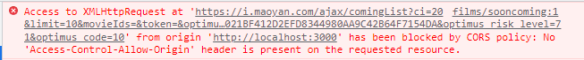

### 解决跨域的方法有：

### 1. jsonp：需要后端更改接口

补充一下。。。。。。。。。。。。。。。。。。。。。。。。。。。。。。。。

### 2. cors：后端在接口的返回头加上 Access-Control-Allow-Origin: \*

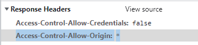

### 3. 反向代理：在 react 项目开发中，当请求后端接口时，做一个反向代理，先向自己的本地服务器 localhost 请求，localhost 这台服务器再向后端这台真正的服务器请求数据拿回来给客户端用，所以就不存在跨域了。

### react 中反向代理是利用 node 的中间件：[http-proxy-middleware](https://create-react-app.dev/docs/proxying-api-requests-in-development)，src 下新建 setupProxy.js，然后重启服务：

```js
const { createProxyMiddleware } = require('http-proxy-middleware');

module.exports = function (app) {
  app.use(
    '/ajax',
    createProxyMiddleware({
      target: 'https://i.maoyan.com',
      changeOrigin: true,
    })
  );
};
```

```js
// 请求时朝着ajax开始的路径发
useEffect(() => {
  axios({
    url:
      '/ajax/comingList?ci=20&limit=10&movieIds=&token=&optimus_uuid=0B1360C06EC711ED9202F7A3C5B5021BF412D2EFD8344980AA9C42B64F7154DA&optimus_risk_level=71&optimus_code=10',
  }).then((res) => {
    console.log(res.data);
  });
}, []);
```

## 九、CSS 模块化

### React 是单页面应用，每个页面的样式都是在 head 的 style 下，所以在一个组件内给一个 div 起一个类名，在别的组件内给一个 div 起同样的类名，会应用到全局的样式，样式也会起到覆盖。

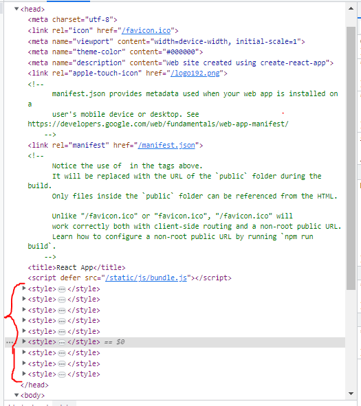

### css 模块化只对类名和 id 名起效，编译时会在类名或者 id 名后面加随机数，保证是唯一的不会与应用内其他的同名。

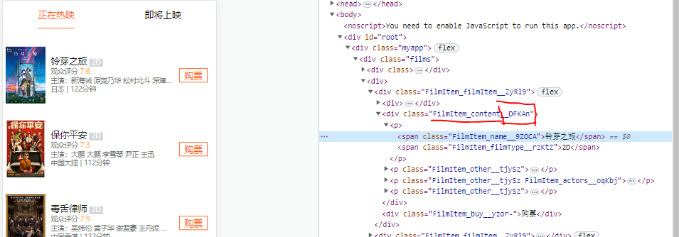

### 使用方法：css 命名为 xx.module.css，页面中引入 xx.module.css 即可

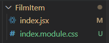

```js
import styles from './index.module.css';
<div className={styles.content}></div>;
```

### 全局样式

```css
:global(.qiuli) {
  color: orange;
}
```

## 十、Redux

```bash
npm i redux -S
```

### 1. redux 工作流

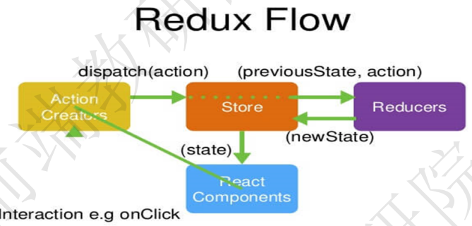

#### 一个组件如果要更新状态，这个状态是跟其他组件共享的。在组件内先 dispatch 一个 action 对象，触发对应的 actionCreator，把 action 对象送到 store 里面，store 不能直接更新状态，需要通过 reducer 来更新状态，reducer 接收老的状态和 action，然后基于 action 的 type 判断返回新的状态，新的状态一更新，就通知订阅者的组件来更新 state。

### 2. redux 的三大原则：

#### a. state 是以单一对象存储的

#### b. state 是只读的，每次修改要深复制一份

#### c. 使用纯函数 reducer 执行 state 更新

#### 纯函数定义：1.对外界没有副作用（修改对象时不对原对象产生影响）2.同样的输入得到同样的输出（不管调用多少遍结果都一样）

```js
// 纯函数
const obj = {
  name: 'qiu',
};
function test(obj) {
  const newObj = { ...obj };
  newObj.name === 'xiaoming';
  return newObj;
}
test(obj);
```

<hr />

### 3. redux 的重要 api：

#### a. subscribe：通知订阅者 store 更新了

#### b. dispatch：提供改变 reducer 的函数

#### c. getState：获取 store 的状态

#### d. 实现 createStore 源码：

```js
const createQStore = (reducer, initialstate) => {
  var list = [];
  initialstate = reducer();

  function subscribe(callback) {
    list.push(callback);
  }
  function dispatch(action) {
    initialstate = reducer(initialstate, action);
    for (var i in list) {
      list[i] && list[i]();
    }
  }
  function getState() {
    return initialstate;
  }
  return {
    subscribe,
    dispatch,
    getState,
  };
};
```

### 4.redux 拆分合并

```js
import { createStore, combineReducers, applyMiddleware, compose } from 'redux';
// 将处理不同业务的reducer拆分出来
import tabbarReducer from './reducers/tabbarReducer';
import cityReducer from './reducers/cityReducer';
import CinemaReducer from './reducers/cinemaReducer';
// npm i redux-thunk -S
import ReduxThunk from 'redux-thunk';
// npm i redux-promise -S
import ReduxPromise from 'redux-promise';

const reducer = combineReducers({
  // Define a top-level state field named `todos`, handled by `todosReducer`
  tabbarReducer,
  cityReducer,
  CinemaReducer,
});

// applyMiddleware应用中间件
const store = createStore(reducer, applyMiddleware(ReduxThunk, ReduxPromise));

export default store;
```

### 5.applyMiddleware 应用中间件：处理异步

```js
import axios from 'axios';

/**
 * redux-thunk中间件风格：
 * actionCreator内如果是同步返回一个普通js对象，{type:"xx",payload:xx}
 * 如果是异步返回一个函数，需要redux-thunk这个外挂支持
 */
function getCinemaList(cityId) {
  return (dispatch) => {
    axios({
      url: `https://m.maizuo.com/gateway?cityId=${cityId}&ticketFlag=1&k=4558896`,
      headers: {
        'X-Client-Info':
          '{"a":"3000","ch":"1002","v":"5.2.1","e":"16789325361560653676412929","bc":"110100"}',
        'X-Host': 'mall.film-ticket.cinema.list',
      },
    }).then((res) => {
      // console.log(res.data.data.cinemas);
      dispatch({
        type: 'fetch_cinemaList',
        payload: res.data.data.cinemas,
      });
    });
  };
}

/**
 * redux-promise中间件风格：
 * Promise三种状态：fulfilled，pending，reject
 */
// function getCinemaList (cityId) {
//   return axios({
//     url: `https://m.maizuo.com/gateway?cityId=${cityId}&ticketFlag=1&k=4558896`,
//     headers: {
//       'X-Client-Info': '{"a":"3000","ch":"1002","v":"5.2.1","e":"16789325361560653676412929","bc":"110100"}',
//       'X-Host': 'mall.film-ticket.cinema.list'
//     }
//   }).then((res) => {
//     // console.log(res.data.data.cinemas);
//     return {
//       type: "fetch_cinemaList",
//       payload: res.data.data.cinemas
//     };
//   });
// }

export default getCinemaList;
```

## 十一、react-redux

```bash
npm i react-redux -S
```

#### 借助在 redux 之上，reducers，state 没有改变，只是提供了 Provider 和 connect 方法

### 1.Provider：让容器组件拿到 store 的 state，利用 context 上下文（生产者与消费者模式）

```js
root.render(
  <Provider store={store}>
    <App />
  </Provider>
);
```

### 2.connect：高阶组件，HOC。connect 可以让低级组件不需要再去订阅、取消订阅、手动获取 store 的值，可以定制化属性映射到低级组件的 props 上。

```js
import styles from '../css/search.module.css';
import React, { useState, useEffect, useMemo } from 'react';
import { CinemaItem } from './Cinemas';
import getCinemaList from '../redux/actionCreators/getCinemaList';
import { connect } from 'react-redux';

function Search(props) {
  // 让请求在redux中发，保证view层只处理ui层，如果先进的是search页面
  useEffect(() => {
    if (!props.cinemaList.length) {
      props.getCinemaList(props.cityId);
    } else {
      console.log('从 store 缓存中读取');
    }
  }, []);

  return (
    <div className={styles.root}>
      {!myValue.length && (
        <div className={styles.nearArea}>
          <p>离你最近</p>
          <ul>
            {props.cinemaList.slice(0, 5).map((item) => {
              return <li key={item.cinemaId}>{item.name}</li>;
            })}
          </ul>
        </div>
      )}
    </div>
  );
}

// 传给属性
const mapStateToProps = (state) => {
  console.log(state, 'reducer的state');
  return {
    cinemaList: state.CinemaReducer.cinemaList,
    cityId: state.cityReducer.cityId,
  };
};

// 回调方法
const mapDispatchToProps = {
  getCinemaList,
  hideTabbar() {
    return {
      type: 'tabbar_hide',
    };
  },
};

export default connect(mapStateToProps, mapDispatchToProps)(Search);
```

### 3.connect 源码实现

```js
import React from 'react';

function NotFound(props) {
  console.log(props, 'props');
  return <div>404 not found</div>;
}

/**
 *
 * 实现connect HOC源码
 * HOC：接收一个低级组件，返回一个具有某种功能的高级组件
 * HOC能做到：
 * 1.劫持渲染：比如让低级组件整个组件的字体变成红色等...
 * 2.代码复用
 * 3.增删改props
 */
const qiuConnect = (cb, obj) => {
  const state = cb();
  return (MyComponent) => {
    return (props) => {
      return (
        <div style={{ color: 'red' }}>
          <MyComponent {...state} {...props} {...obj} />
        </div>
      );
    };
  };
};

export default qiuConnect(
  () => {
    return {
      a: 1,
      b: 2,
    };
  },
  {
    aa() {
      return 'aa';
    },
    bb() {
      return 'bb';
    },
  }
)(NotFound);
```

### 4. redux 持久化

```bash
npm i redux-persist -S
```

#### redux 的数据是存在内存中的，每次一刷新浏览器内存就清空了，借助 redux-persist 实现数据持久化

```js
import { createStore, combineReducers, applyMiddleware, compose } from 'redux';
import { persistStore, persistReducer } from 'redux-persist';
import storage from 'redux-persist/lib/storage'; // defaults to localStorage for web
// 将处理不同业务的reducer拆分出来
import tabbarReducer from './reducers/tabbarReducer';
import cityReducer from './reducers/cityReducer';
import CinemaReducer from './reducers/cinemaReducer';
import ReduxThunk from 'redux-thunk';
import ReduxPromise from 'redux-promise';

const reducer = combineReducers({
  // Define a top-level state field named `todos`, handled by `todosReducer`
  tabbarReducer,
  cityReducer,
  CinemaReducer,
});

// redux持久化
const persistConfig = {
  key: 'root',
  storage,
  whitelist: ['CinemaReducer'], // 只有白名单的才会持久化
};

const persistedReducer = persistReducer(persistConfig, reducer);

// 配置redux-devtools
const composeEnhancers = window.__REDUX_DEVTOOLS_EXTENSION_COMPOSE__ || compose;
/**
 * 在redux中处理异步需要redux-thunk（返回函数）或redux-promise（返回Promise对象）中间件加持
 * 同步即返回纯js对象
 */
const store = createStore(
  persistedReducer,
  composeEnhancers(applyMiddleware(ReduxThunk, ReduxPromise))
);
let persistor = persistStore(store);

export { store, persistor };
```

```js
root.render(
  // Provider 把store通过context上下文传递给App组件，是所有组件都能拿到store的值
  <Provider store={store}>
    <PersistGate loading={null} persistor={persistor}>
      <App />
    </PersistGate>
  </Provider>
);
```

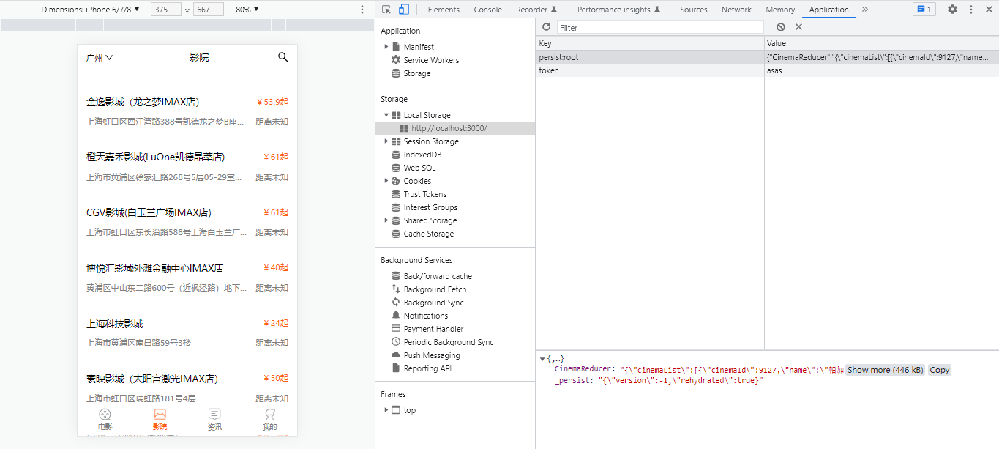

## 十二、UI 组件库

### 1.antd

### 2.antd_mobile

## 十三、immutable

### 1.在 react 中，做 setState 更新的时候要对原有的对象进行深复制，不能影响老的 state；在 redux 中，也要对 prevState 老的状态深复制一份，然后再修改，修改完了再返回一个新状态。

```bash
npm i immutable -S
```

### 2.浅拷贝与深拷贝

```js
// 1.引用复制（浅复制）
const aObj = {
  name: 'aaaa',
};
const aObj2 = aObj;
aObj2.name = 'bbb';
console.log('aObj', aObj, aObj2); // 影响了原对象：都被修改为bbb了

// 2.浅意义的深复制（只对普通数据类型深复制，对引用数据类型浅复制）
const bObj = {
  name: 'aaa',
  arr: [1, 2, 3],
  obj: {
    age: 18,
    nation: '中国',
  },
};
const bObj2 = { ...bObj };
bObj2.name = 'bbb'; // 没有影响了原对象
bObj2.arr.splice(1, 1); // 影响了原对象：arr是引用数据类型
bObj2.obj.nation = '美国'; // 影响了原对象：obj是引用数据类型
console.log('bObj', bObj, bObj2);

// 3.JSON.parse(JSON.stringify)（对undefined失效，复制不了值为undefined的键）
const cObj = {
  name: 'aaa',
  arr: [1, 2, 3],
  text: undefined,
};
const cObj2 = JSON.parse(JSON.stringify(cObj));
cObj2.name = 'bbb'; // 没有影响了原对象
cObj2.arr.splice(1, 1); // 没有影响了原对象
console.log('cObj2', cObj, cObj2);

// 深拷贝：递归一层一层   （性能太差，消耗性能）

// immutable：使用旧数据创建新数据时，能够保证旧数据可用且不变
```

### 3.immutable 对象修改的原则：在 immutable 对象上修改，不会影响原对象。immutable 对象修改的时候，如果其他属性跟原有对象一致，会复用原有对象属性。

### 4.immutable 库的使用

#### （1）Map 的使用

| 属性层级 | 设置属性                              | 获取属性                       | 普通 js 对象 -> immutable 对象 | immutable 对象 -> 普通 js 对象 | 修改属性内为数组的数据                               |
| -------- | ------------------------------------- | ------------------------------ | ------------------------------ | ------------------------------ | ---------------------------------------------------- |
| 一层     | set("name","xxx")                     | get("name")                    |                                |                                |                                                      |
| 一层     | setIn(["locaiton","province"],"中国") | getIn(["locaiton","province"]) |                                |                                |                                                      |
| 不论层级 |                                       |                                | fromJS()                       | toJS()                         | updateIn(["favor"], value => value.splice(index, 1)) |

```js
import React, { useState } from 'react';
import { fromJS } from 'immutable';

/**
 * fromJS：把immutable对象转为普通js对象
 * setIn：修改多层级键的值 setIn([],xx)
 * getIn：获取多层级键的值 getIn([])
 * updateIn：修改List数组的键 updateIn([],value => xxx)
 */

export default function App() {
  const obj = {
    name: 'aaa',
    location: {
      province: '广东省',
      city: '广州市',
    },
    favor: ['睡觉', '玩游戏', '吃美食'],
  };

  const [data, setdata] = useState(fromJS(obj));

  // console.log(data.toJS());

  return (
    <div>
      <button
        onClick={() => {
          // setdata(data.set("name", "bbb"));
          setdata(data.setIn(['name'], 'bbb'));
        }}
      >
        修改姓名
      </button>
      <p>姓名：{data.get('name')}</p>
      <button
        onClick={() => {
          setdata(
            data
              .setIn(['location', 'province'], '浙江省')
              .setIn(['location', 'city'], '嘉兴市')
          );
        }}
      >
        修改籍贯
      </button>
      <p>
        籍贯：{data.getIn(['location', 'province'])}-
        {data.getIn(['location', 'city'])}
      </p>
      <div>
        {data.getIn(['favor']).map((item, index) => (
          <div>
            <span key={item}>{item}</span>
            <button
              onClick={() => {
                setdata(
                  data.updateIn(['favor'], (value) => value.splice(index, 1))
                );
              }}
            >
              删除
            </button>
            <button
              onClick={() => {
                setdata(data.setIn(['favor', index], '和男朋友去玩'));
              }}
            >
              修改
            </button>
          </div>
        ))}
      </div>
    </div>
  );
}
```

#### （2）List 的使用：跟数组的方法一模一样

```js
import { List } from 'immutable';

/* 对数组进行任何操作，不会改变原数组 */
const arr1 = List([1, 2, 3]);
const arr2 = arr1.push(4);
const arr3 = arr2.unshift(0);
const arr4 = arr3.concat([5, 6, 7]);
console.log(arr1.toJS(), arr2.toJS(), arr3.toJS(), arr4.toJS());
```

## 十四、[mobx](https://cn.mobx.js.org/)

### 1.原理：Mobx 利用 getter 和 setter 来收集组件的数据依赖关系，从而在数据发生变化的时候精确知道哪些组件需要重绘，在界面的规模变大的时候，往往会有很多细粒度更新。

### 2.mobx 与 redux 区别

#### a.对一份数据直接进行修改操作，不需要始终返回一个新的数据

#### b.Redux 默认以 JavaScript 原生对象形式存储数据，而 Mobx 使用可观察对象

#### c.并非单一 store,可以多 store

#### d.Mobx 写法上更偏向于 OOP

### 3.mobx-react 的使用

```bash
npm i mobx@5 -S
npm i mobx-react@5 -S
```

#### Provider 包裹根组件，传递 store 的名称给 inject 使用，让 store 变成组件的 porps

```js
import { Provider } from 'mobx-react';
root.render(
  // Provider 把store通过context上下文传递给App组件，是所有组件都能拿到store的值\
  <Provider store={store}>
    <App />
  </Provider>
);
```

#### 组件中使用 store，@observer 让组件变成可观察组件

```js
import React, { Component } from 'react';
import IndexRouter from './router/IndexRouter';
import TabBar from './components/TabBar';
import { inject, observer } from 'mobx-react';

/* 类组件中监听store状态 */
@inject('store') // 注入store
@observer // 变成观察组件
class MyApp extends Component {
  componentDidMount = () => {
    console.log(this.props.store.isShowTabbar);
  };

  render() {
    return (
      <div className="myapp">
        <IndexRouter>
          {/* 插槽的写法 */}
          {this.props.store.isShowTabbar && <TabBar />}
        </IndexRouter>
      </div>
    );
  }
}

export default MyApp;
```

#### store 编写

```js
import { observable, action, runInAction } from 'mobx';
import axios from 'axios';

class Store {
  @observable isShowTabbar = true; // 变成可观察数据
  @observable cinemaList = [];

  @action async fetchCinemaList() {
    const list = await axios({
      url: `https://m.maizuo.com/gateway?cityId=440100&ticketFlag=1&k=4558896`,
      headers: {
        'X-Client-Info':
          '{"a":"3000","ch":"1002","v":"5.2.1","e":"16789325361560653676412929","bc":"110100"}',
        'X-Host': 'mall.film-ticket.cinema.list',
      },
    }).then((res) => {
      // console.log(res.data.data.cinemas);
      return res.data.data.cinemas;
    });
    // 处理异步
    runInAction(() => {
      this.cinemaList = list;
    });
  }

  @action showTabbar() {
    this.isShowTabbar = true;
  }

  @action hideTabbar() {
    this.isShowTabbar = false;
  }
}

const store = new Store();

export default store;
```

### 4.配置装饰器

```bash
npm i @babel/core @babel/plugin-proposal-decorators @babel/preset-env
npm i customize-cra react-app-rewired
```

#### 创建 .babelrc

```js
{
  "presets": [
    "@babel/preset-env"
  ],
    "plugins": [
      [
        "@babel/plugin-proposal-decorators",
        {
          "legacy": true
        }
      ]
    ]
}
```

#### 创建 config-overrides.js

```js
const path = require('path');
const { override, addDecoratorsLegacy } = require('customize-cra');
function resolve(dir) {
  return path.join(__dirname, dir);
}
const customize = () => (config, env) => {
  config.resolve.alias['@'] = resolve('src');
  if (env === 'production') {
    config.externals = {
      react: 'React',
      'react-dom': 'ReactDOM',
    };
  }
  return config;
};
module.exports = override(addDecoratorsLegacy(), customize());
```

#### 修改 package.json

```json
"scripts": {
"start": "react-app-rewired start",
"build": "react-app-rewired build",
"test": "react-app-rewired test",
"eject": "react-app-rewired eject"
},
```

#### VScode 配置 setting

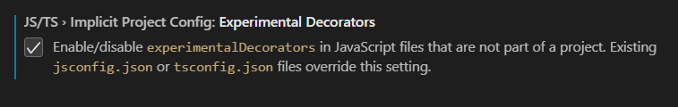
